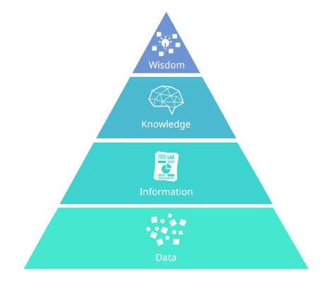
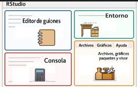

# Introducción al análisis de datos reproducible

## Objetivo de la clase

Al finalizar esta clase, el/la estudiante deberá ser capaz de:

-   Comprender qué significa trabajar con datos y por qué es central en la toma de decisiones.

-   Diferenciar datos, información, conocimiento y sabiduría.

-   Reconocer la importancia de la calidad del dato.

-   Identificar las herramientas principales que se utilizarán durante el curso (R, RStudio y paquetes).

## 1. Tomar decisiones con datos

De manera consciente o inconsciente, las personas toman decisiones todo el tiempo: personales, profesionales, organizacionales. Algunas decisiones tienen bajo impacto, otras pueden tener consecuencias importantes y duraderas.

En contextos académicos, científicos, productivos u organizacionales, **las decisiones no deberían basarse solo en intuición**, sino en información confiable obtenida a partir de datos.

Aquí es donde entra el análisis de datos: como una herramienta para **reducir la incertidumbre** y mejorar la calidad de las decisiones.

## 2. De los datos a la sabiduría: la pirámide DIKW

Este enfoque se basa en el modelo conceptual conocido como **DIKW** (Data–Information–Knowledge–Wisdom), ampliamente utilizado en gestión del conocimiento y análisis de sistemas [@ackoff1989].

Para entender el rol del análisis de datos, utilizamos un marco conceptual clásico: la **pirámide DIKW**, que describe la relación entre:

-   **Datos (Data)**

-   **Información (Information)**

-   **Conocimiento (Knowledge)**

-   **Sabiduría (Wisdom)**



### Datos

Los datos son hechos crudos: números, símbolos o registros sin contexto. Por sí solos no explican nada ni responden preguntas. Un listado de valores, una planilla llena de números o una base de datos sin analizar son solo datos.

### Información

La información surge cuando los datos se **organizan, ordenan y contextualizan**. La información responde preguntas como: qué ocurrió, cuándo, dónde o cuánto.

### Conocimiento

El conocimiento aparece cuando la información se interpreta, se relaciona con experiencias previas y permite **comprender patrones, variabilidad y relaciones**. El conocimiento responde al “cómo”.

### Sabiduría

La sabiduría implica usar el conocimiento con criterio, prudencia y visión de largo plazo. Permite decidir qué acciones valen la pena. Es el nivel más alto y se construye con el tiempo y la experiencia.

Este curso se enfoca principalmente en **transformar datos en información y conocimiento**, sentando las bases para una mejor toma de decisiones.

## 3. El dato como materia prima

Los datos son la materia prima del análisis. Sin datos adecuados, no hay información confiable ni conocimiento útil.

Sin embargo, **obtener datos no es gratis**: requiere tiempo, recursos, tecnología y decisiones metodológicas. Por eso es importante aplicar el **principio de parsimonia**:

No recolectar más datos de los necesarios, pero sí los datos correctos.

Antes de analizar, siempre debemos preguntarnos:

-   ¿Para qué se recolectaron estos datos?

-   ¿Son relevantes para el problema que queremos estudiar?

-   ¿Qué limitaciones tienen?

## 4. Calidad del dato: ideas clave

Para que los datos puedan transformarse en información y conocimiento, deben tener **calidad**. Sin entrar aún en definiciones técnicas complejas, en esta etapa nos quedamos con algunas ideas fundamentales:

-   **Exactitud**: que el dato represente correctamente la realidad.

-   **Completitud**: que no falten valores relevantes.

-   **Consistencia**: que no haya contradicciones internas.

-   **Actualización**: que el dato sea pertinente en el tiempo.

Un principio básico del análisis de datos es:

> *Si los datos son de mala calidad, el resultado del análisis también lo será.*

## 5. Herramientas del curso: R, RStudio y paquetes

Para trabajar con datos utilizaremos el lenguaje **R** y el entorno **RStudio**.

### ¿Qué es R?

R es un lenguaje de programación y un entorno de software diseñado para el análisis estadístico, la visualización de datos y la ciencia de datos. Permite realizar cálculos, generar gráficos y construir modelos.

### ¿Qué es RStudio?

RStudio es un **entorno de desarrollo integrado (IDE)** que facilita el trabajo con R. Proporciona una interfaz organizada para escribir código, ejecutarlo, visualizar resultados y gestionar proyectos.

{fig-align="center"}

### ¿Qué son los paquetes?

Los paquetes son extensiones que agregan funciones específicas a R. Permiten realizar tareas de forma más rápida, clara y eficiente.

### Analogía con una biblioteca

-   **R** es el idioma.

-   **RStudio** es la biblioteca donde trabajamos.

-   **Los paquetes** son colecciones de libros especializados.

{fig-align="center"}

### Instalar y cargar paquetes

-   **Instalar** un paquete es descargarlo en la computadora (se hace una sola vez).

-   **Cargar** un paquete es activarlo para usarlo en una sesión de trabajo (se hace cada vez que se necesita).

### ¿Qué es un objeto en R?

Un **objeto** es cualquier elemento que almacena información en la memoria de R. Puede contener un único valor, una colección de valores, una tabla de datos o incluso una función.

En otras palabras, un objeto es el lugar donde R guarda los datos con los que trabajaremos.

#### Crear un objeto

La asignación se realiza mediante el operador `<-`.

```{r}
edad <- 35
```

Aquí:

-    `edad` es el nombre del objeto.

-    `35` es el valor almacenado.

#### Reglas para nombrar objetos 

-    Deben comenzar con una letra.

-    Pueden contener números.

-    Pueden contener guiones bajos (`_`).

-    No deben contener espacios.

-    Conviene utilizar nombres descriptivos.

Correctos:

```{r}
#| eval: false
#| include: false
    edad
```

```{r}
#| eval: false
#| include: false
total_emision
```

Incorrectos

```{r}
#| eval: false
#| include: false
2edad
```

```{r}
#| eval: false
#| include: false
total emisión
```

Podemos visualizar su contenido escribiendo el nombre del objeto.

#### ¿Qué tipos de objetos utilizaremos?

No hace falta presentar todos los objetos de R. Para este curso bastan cuatro.

#### a) Vectores

Un vector es una colección de elementos del mismo tipo.

```{r}
paises <- c(   "Argentina",   "Brasil",   "Chile" )
```

```{r}
temperaturas <- c(
  0.4,
  0.6,
  0.8
)
```

#### b) Data Frame

Es una tabla donde

-    cada fila representa una observación;

-    cada columna representa una variable.

Es el objeto más utilizado en análisis de datos.

```{r}
datos <- data.frame(
  pais = c("Argentina", "Brasil"),
  emision = c(120,350)
)
```

#### c) Tibble

Es la versión moderna del **data frame**.

Cuando usamos **Tidyverse**

#### d) Factores

Los factores representan variables categóricas.

```{r}
continente <- factor(
  c(
    "América",
    "Europa",
    "Asia"
  )
)
```

####  ¿Cómo saber qué tipo de objeto tenemos?

```{r}
class(datos)
```

### El entorno de trabajo (Environment)

Cada vez que se crea un objeto, éste aparece en el panel **Environment** de RStudio.

Por ejemplo,

```{r} 
pais <- "Argentina"  
anio <- 2020  
temperatura <- 0.56
```

 

## 6. R como calculadora y uso de scripts

R puede utilizarse como una calculadora avanzada, permitiendo realizar operaciones matemáticas, trabajar con funciones y almacenar resultados en objetos.

Por ejemplo en la consola escribir:

```{r}
2+2
```

```{r}
log(20)
```

```{r}
sqrt(89)
```

También es posible guardar resultados en objetos:

```{r}
x <- 10
y <- 5

x + y
```

En R, el símbolo \<- se utiliza para asignar valores a objetos.

Hasta aquí, las instrucciones pueden escribirse directamente en la consola. Sin embargo, trabajar únicamente en la consola tiene una limitación importante: el código no queda guardado de manera organizada.

Por esta razón, habitualmente se trabaja utilizando **scripts**.

Un script es un archivo de texto con extensión .R que contiene instrucciones escritas en el lenguaje R. Los scripts permiten:

-   Guardar el trabajo realizado

-   Reutilizar código Corregir errores fácilmente Compartir análisis con otras personas

-   Mantener un registro ordenado del análisis

    Los scripts también permiten agregar comentarios para documentar el código:

    ```{r}
    # Cálculo del índice de masa corporal

    peso <- 78
    altura <- 1.72

    imc <- peso/(altura^2)

    imc
    ```

    En RStudio, un script puede crearse desde:

    **File → New File → R Script**

    Las líneas de código pueden ejecutarse individualmente utilizando:

    -   

    -   **Ctrl + Enter** (Windows/Linux)

    -   

    -   **Cmd + Enter** (Mac)

    -   

    El uso de scripts constituye el primer paso hacia un trabajo más organizado y reproducible en análisis de datos.

    ## 7. Ciencia reproducible y Quarto

    A medida que los análisis se vuelven más complejos, surge la necesidad de integrar no solo código, sino también explicaciones, resultados y gráficos en un único documento.

    En este contexto aparece el enfoque de la **ciencia reproducible**.

    Según \[\@peng2011\], un análisis es reproducible cuando otras personas pueden obtener los mismos resultados utilizando los mismos datos y el mismo código.

    Para trabajar bajo este enfoque utilizaremos **Quarto**, una herramienta que permite crear documentos reproducibles integrando:

    -   Texto explicativo

    -   Código en R

    -   Tablas y gráficos

    -   Resultados de modelos y análisis

En un único archivo reproducible.

El objetivo no es solo analizar datos, sino **documentar y comunicar el proceso completo del ana´lsis de datos de una manera clara, ordenada y reproducbiel** favoreciendo la transparencia y el aprendizaje.

## 8. Cierre de la clase

En esta primera clase vimos:

-   Por qué los datos son centrales en la toma de decisiones.

-   Cómo se relacionan datos, información, conocimiento y sabiduría.

-   La importancia de la calidad del dato.

-   Las herramientas que utilizaremos durante el curso.

-   La filosofía de la ciencia reproducible.

En las próximas clases comenzaremos a trabajar de manera más práctica con datos reales, aprendiendo a importarlos, organizarlos y explorarlos paso a paso.

## Referencias

Ackoff, R. L. (1989). *From data to wisdom*. Journal of Applied Systems Analysis, 16, 3–9.

Peng, R. D. (2011). Reproducible research in computational science. *Science*, 334(6060), 1226–1227. https://doi.org/10.1126/science.1213847

Posit PBC. (2025). *Quarto: Sistema de publicación científica y técnica*. https://quarto.org
