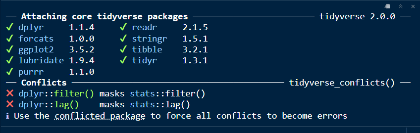

# Carga y manipulación de datos

Antes de poder analizar cualquier conjunto de datos, es necesario saber cómo llevarlos al entorno de trabajo y dejarlos en condiciones adecuadas para su análisis. Esta etapa, conocida habitualmente como *data wrangling*, constituye un prerrequisito técnico-metodológico para cualquier análisis estadístico posterior: sin datos correctamente importados, estructurados y depurados, ningún modelo ni ninguna exploración pueden considerarse confiables.

En esta clase abordaremos los primeros pasos necesarios para trabajar con R y RStudio: la instalación y activación de los paquetes que utilizaremos a lo largo del curso, la importación de bases de datos externas, y el reconocimiento de la estructura de los objetos que R genera a partir de ellas. Además, introduciremos las herramientas básicas para la manipulación de datos —filtrado, selección y transformación de variables— que nos permitirán preparar la información antes de iniciar su análisis exploratorio.

Las competencias desarrolladas en esta clase son transversales a todo el curso: se utilizarán tanto en el análisis exploratorio de datos (Clase 3) como en el ajuste de los Modelos Lineales (Clase 4 y Clase ), y constituyen la base operativa sobre la cual se apoya cualquier análisis estadístico riguroso.

## Paquetes: las herramientas que vamos a usar

R tiene muchas funciones incorporadas, pero los paquetes amplían sus posibilidades.

En este curso trabajaremos principalmente con el ecosistema tidyverse, que reúne paquetes para trabajar de manera ordenada y coherente con datos.

| Paquete   | ¿Para qué lo usaremos?                           |
|-----------|--------------------------------------------------|
| `readr`   | Importar archivos `.csv`.                        |
| `readxl`  | Importar archivos de Excel.                      |
| `dplyr`   | Seleccionar, filtrar, crear y resumir variables. |
| `tidyr`   | Ordenar la estructura de una base.               |
| `ggplot2` | Crear gráficos.                                  |
| `janitor` | Limpiar nombres de variables y tablas.           |
| `forcat`  | para trabajar con factores                       |

Para mayor información no dudes en visitar la [Página oficial de Tidyverse](https://tidyverse.tidyverse.org/)

## Activación de bloque de código (Chunk)

Los **bloques de código** permiten escribir y ejecutar instrucciones en R dentro de un documento Quarto. Cada bloque puede contener una o varias líneas de código y mostrar, si se desea, los resultados obtenidos.

**Para insertar un bloque de código en R, podemos hacerlo de dos maneras:**

1.  En la barra superior, buscaremos el ícono verde **+C**. Al hacer clic sobre él, seleccionaremos **R**.

{width="185"}

2.  También podemos utilizar el teclado, presionando simultáneamente **Ctrl + Alt + I**.\
    En ambos casos un bloque como el siguiente, donde podremos ejecutar código en **R**:

ra: Espacio para escribir Código en R (Chunk)](images/chunk%20vacío.png){width="452"}

### Opciones de los bloques de código

Los bloques de código pueden incluir opciones que permiten controlar cómo se ejecuta el código y qué se muestra en el documento final.

Estas opciones se escriben al comienzo del bloque, precedidas por #\|.

```         
#| echo: false
#| warning: false
```

Algunas opciones frecuentes son:

#\| echo: true → muestra el código en el documento.

#\| echo: false → ejecuta el código, pero no lo muestra.

#\| eval: false → muestra el código, pero no lo ejecuta.

#\| include: false → ejecuta el código, pero no muestra ni el código ni los resultados.

#\| warning: false → oculta los mensajes de advertencia.

#\| message: false → oculta los mensajes generados por R.

## Instalación de Paquetes

los **paquetes** amplían las funcionalidades de R, incorporando nuevas funciones y herramientas. Para instalar un paquete, escribimos dentro de un bloque de código la función `install.packages()`, indicando entre comillas el nombre del paquete que queremos instalar.

Por ejemplo:

```{r}
#| eval: false

install.packages("tidyverse")
```

Los paquetes se instalan una sola vez, salvo que sea necesario actualizar el paquete.

Una vez instalado, el paquete debe **cargarse para su uso** mediante la función `library()`.

Por ejemplo:

```{r}
#| eval: false

library(tidyverse)
```

## Importación de la base de datos

Importar datos significa leer un archivo externo y convertirlo en un objeto que R pueda utilizar.

Para archivos CSV puede emplearse `read_csv()`. Esta función genera un objeto de tipo `tibble`, una versión moderna de un data frame.

## Código en R

Suponiendo que el archivo está dentro de la carpeta `datos`:

```{r}
#| eval: false

datos <- read_csv("../datos originales/base_datos.csv")
```

Para comprobar que el objeto fue creado:

```{r}
#| eval: false

view(datos) 
```

También puede observarse en el panel Environment de RStudio.

{width="465"}

Para importar archivos de Excel, con extención xlsx, necesitaremos además tener instalado el paquete *readxl:*

```{r}
#| eval: false

install.packages("readxl") # solo la primera vez
library(readxl)            # en cada sesión

```

## Diferencia entre objeto y archivo

El archivo original permanece almacenado en la computadora como base_datos.csv

El objeto creado dentro de R se denomina:

datos

Modificar el objeto datos no altera automáticamente el archivo CSV original.

# Primera inspección de la base

### Conozcamos los datos

Al comenzar una investigación que utiliza una base de datos, es importante conocer y comprender su estructura. Para ello, debemos responder algunas preguntas iniciales: **¿Cuál es la unidad de análisis? ¿Qué representa cada fila? ¿Qué representa cada columna? ¿Cuántas observaciones y variables contiene la base? ¿Cómo se llaman las variables? ¿Qué tipo de información contiene cada una? ¿Existen datos faltantes o valores atípicos o extraños?**

A continuación, se presentan algunas funciones iniciales de R que nos ayudarán a responder estas preguntas y a realizar una primera exploración de la base de datos**.**

Funciones iniciales:

```{r}
#| eval: false

glimpse(datos)
```

Permite observar rápidamente:

- la cantidad de filas y columnas;

- los nombres de las variables;

- el tipo de cada variable;

- algunos valores de ejemplo.

```{r}
#| eval: false

names(datos)
```

Muestra los nombres de las variables.

```{r}
#| eval: false

dim(agro)
```

Indica la cantdiad de filas y columnas de la base.

```{r}
#| eval: false

summary(datos)
```

Presenta un **resumen general de las variables**. La información que muestra depende del tipo de variable.

También pueden consultarse por separado el número de filas y de columnas con las siguentes funciones:

```{r}
#| eval: false


nrow(datos) # númeo de filas 
ncol(datos) # númeo de columnas
```

### ¿Qué significa limpiar y ordenar los datos?

Una base de datos puede estar completa y, sin embargo, no estar lista para ser analizadas.

### Paquetes `dplyr` y `tidyr`

`dplyr` y `tidyr` forman parte del conjunto de paquetes **tidyverse** y se utilizan para preparar y organizar bases de datos antes del análisis.

- **`dplyr`** permite manipular los datos: seleccionar variables, filtrar observaciones, ordenar filas, crear o modificar variables y realizar resúmenes.

- **`tidyr`** permite organizar y reestructurar los datos, además de trabajar con valores faltantes.

Ambos paquetes facilitan la **limpieza y preparación de los datos** para su posterior análisis.

Entre las funciones más intersantes poemos mencionar:

- `select()` → seleccionar las variables que queremos conservar.

- `filter()` → seleccionar filas según una condición.

- `arrange()` → ordenar las filas según una o más variables.

- `rename()` → cambiar el nombre de una variable.

- `mutate()` → crear nuevas variables o modificar las existentes.

- `distinct()` → eliminar registros duplicados.

- `drop_na()` → eliminar filas con datos faltantes.

- `replace_na()` → reemplazar valores faltantes.

- `recode()` → unificar o cambiar categorías.

- `clean_names()` de `janitor` → estandarizar los nombres de las variables.

| paquetes | sitio oficial |
|:--------------------------------:|:------------------------------------:|
| {width="82"} | [sitio oficial de dplyr](https://dplyr.tidyverse.org/) |
| {width="78"} | [Sitio oficial de tidyr](https://tidyr.tidyverse.org/) |
